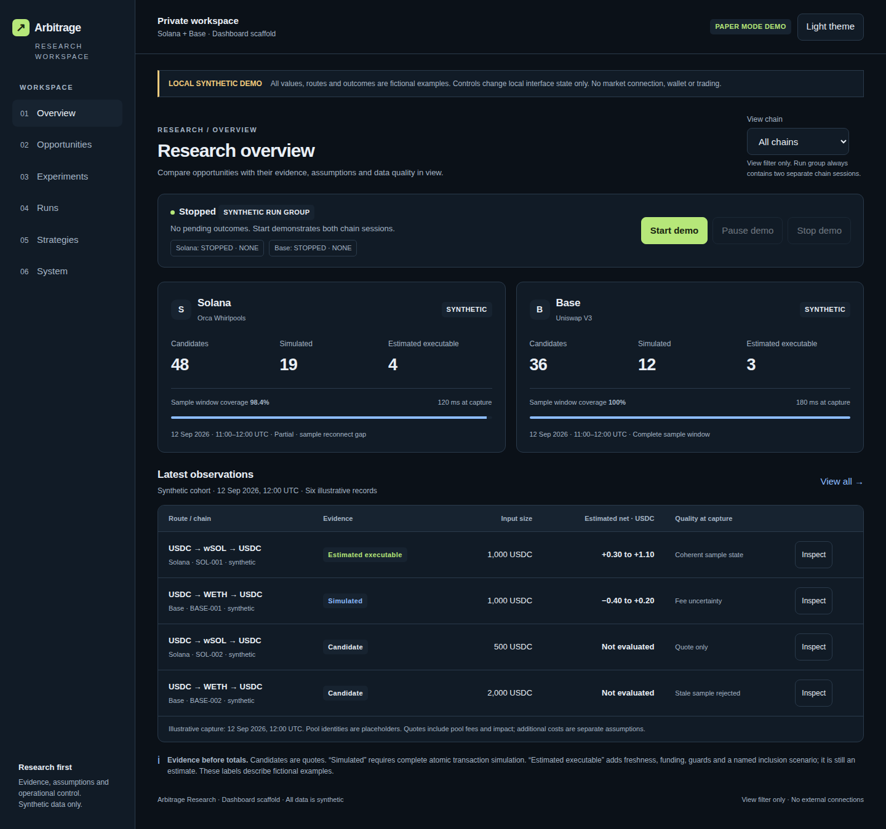

# Arbitrage Research

A Rust-first research platform for comparing same-chain arbitrage opportunities on Base and Solana, with a React and TypeScript dashboard. The first release targets observation, reproducible replay and paper experiments. Live execution is a separately gated future milestone.

**Current implementation: research foundations and controlled observation.** The Rust workspace now includes validated domain/configuration types, PostgreSQL control state, an authenticated API, bounded read-only capture adapters, offline acquisition verification, a scheduler and exact virtual-accounting primitives. The dashboard has explicit Demo and Connected modes. Full protocol qualification, complete atomic transaction simulation, durable paper integration and live execution remain unfinished; no profitability or security-audit claim is made.

## Start here

- [Persistent delivery goal](GOAL.md) and [all-ticket implementation progress](planning/implementation-progress.json)
- [Railway deployment runbook](deploy/RAILWAY.md): selected host, prepared containers and private-service definition

- [Product requirements](docs/01-PRD.md) and [architecture](docs/02-ARCHITECTURE.md)
- [Implementation status](docs/12-IMPLEMENTATION-STATUS.md): what exists and what remains planned
- [Dashboard application](apps/web/README.md) and [approved design reference](design/dashboard-wireframe.html)
- [Complete delivery backlog](planning/BACKLOG.md), [published issue index](planning/GITHUB-ISSUES.md) and [machine-readable ticket specifications](planning/backlog.json)
- [Project wiki source](wiki/Home.md) and [GitHub issues](https://github.com/makafeli/arbitrage-research/issues)
- [Verified GitHub setup status](docs/13-GITHUB-SETUP-STATUS.md), [setup instructions](scripts/README.md) and [test record](docs/11-PACKAGE-VALIDATION.md)

## Dashboard preview

Captured from the verified synthetic dashboard. [Mobile preview](design/dashboard-mobile.png).



## Run the dashboard

Use Node.js 24 or newer. From the repository root:

```sh
cd apps/web
npm ci
npm run dev
```

Open the local URL printed by Vite. Demo mode is explicitly synthetic. Switch to Connected to authenticate against the real API through the local same-origin proxy. Connected failures retain an unavailable/stale state and never fall back to fixtures. `npm test` exercises model and API boundaries; `npm run build` checks types and creates the production bundle.

For the API, start a PostgreSQL development database using [the local setup](deploy/README.md), then follow the [API environment and startup instructions](apps/control-api/README.md). The service requires a provisioned operator secret and database connection; the repository contains no working credential.

The shipped research configuration keeps both networks disabled. Register qualified enabled configurations before creating an OBSERVE session and starting the [controlled research worker](apps/research-worker/README.md). A worker boot recovers into STOPPED and waits for an explicit START. Base and Solana capture CLIs also exist as independent one-shot tools; dashboard controls do not stop those separate processes.

```sh
cargo run --locked -p replay -- --lifecycle-demo
cargo test --workspace --locked
```

The full test command requires a disposable PostgreSQL database in `TEST_DATABASE_URL`. CI provisions it and also checks the real UI API client, browser scenarios and deployment containers. [Replay](apps/replay/README.md) can verify and re-decode captured transcripts offline; it does not yet replay complete economic outcomes.

## Research scope

Initial experiments compare USDC-start, two-leg cycles through distinct pools on each chain: USDC → WETH → USDC on Base and USDC → wSOL → USDC on Solana. Uniswap V3 and Orca Whirlpools are the initial adapter qualification targets. Enabled pools and assets require verified identities and supported behavior; example configuration starts with both networks disabled.

Paper outcomes remain hypothetical. CANDIDATE, SIMULATED, ESTIMATED_EXECUTABLE and REALIZED have different evidence requirements. Paper sessions never report REALIZED returns. Missing costs, stale state and incomplete simulation block stronger claims.

## Controls and safety boundary

Session modes are immutable. Pause and stop require a worker acknowledgement; API acceptance alone does not establish STOPPED. A stopped admission gate can coexist with unresolved previously dispatched attempts, shown as DRAINING. Already emitted transactions cannot be recalled by a dashboard button. Recovery returns to STOPPED and never automatically enables live execution.

Demo mode demonstrates these distinctions using local fixtures. Connected mode submits real durable session commands and waits for server receipts; it does not operate a wallet. The research deployment has no signing or broadcast capability. Funding, signing, executor deployment and any live pilot require the later documented review and activation gates.

## Delivery workflow

The backlog contains product, architecture, chain integration, simulation, UX, security, operations and optional live milestones from M0 through M7. Source changes are not evidence by themselves that a ticket meets its complete acceptance criteria. Select an issue, implement the behavior, attach reproducible verification and review it against the linked requirements before closing it.

All 76 native issues, eight milestones, 23 project labels, 68 epic/task links and 219 blocking dependencies are verified. Native GitHub Project and Wiki publication remain the authenticated workstation steps in the setup status; their source and commands are prepared.

See [CONTRIBUTING.md](CONTRIBUTING.md) for development and review expectations. A software distribution license has not yet been selected; public visibility alone does not grant an open-source license.
