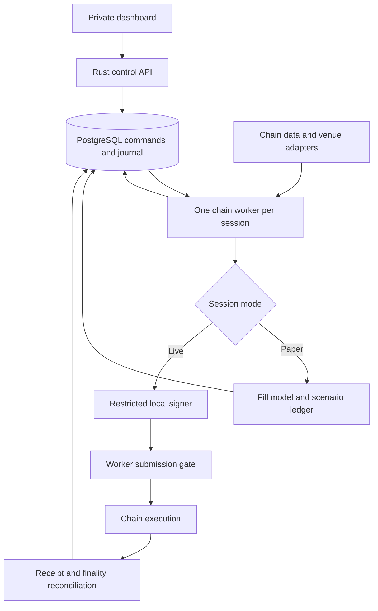
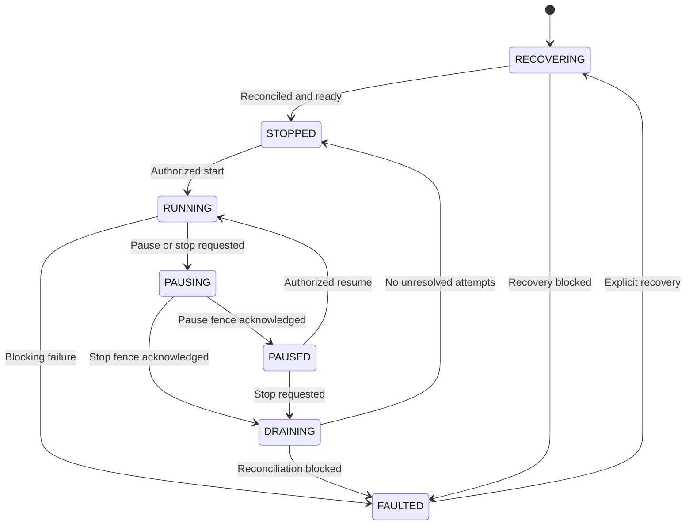

# Architecture

Status: v0.4 architecture and implementation map, 12 September 2026. Bounded capture, candidate route math, durable decisions/virtual accounts, a controlled OBSERVE/PAPER worker, offline replay and a connected dashboard are implemented in source. The execution, simulation and signer branches below remain TARGET architecture. The [collection/export verification record](18-COLLECTION-AND-EXPORT-VERIFICATION.md) owns the latest cohort checkpoint; [implementation status](12-IMPLEMENTATION-STATUS.md) separates implemented scope from qualification and release gates.

## 1. Architectural decision

Build one modular Rust workspace with independently supervised chain workers, a control API, a local signer, and a replay executable. Begin with Base and Solana paper trading. Use separate worker processes to isolate chain failures; retain shared libraries for deterministic calculations, risk rules, persistence, and reporting. A private React dashboard talks only to the control API.

Railway is the selected host for one private operator. Prepared definitions expose only the web origin; Caddy proxies authenticated API requests to a private control API, with PostgreSQL on private networking. Use one API replica for its process-local login sessions and one owner per research session. Each chain worker has its own persistent capture volume and no public port. The default service graph prepares web/API/PostgreSQL; add workers only after configuration and provider qualification. Containers and local development commands remain useful independently of Railway. No Railway deployment, capacity measurement or backup/restore exercise is claimed. See the [Railway runbook](../deploy/RAILWAY.md).

The domain reserves immutable `OBSERVE`, `PAPER`, `REPLAY` and `LIVE` modes. Current controlled workers support OBSERVE and PAPER acquisition/candidate evaluation, with separate virtual-account initialization. The full target adds paper execution scenarios and authorized LIVE submission; the current replay application operates on retained datasets offline. Separate instances can observe the same chain in different modes. Changing mode requires `STOPPED` and a new session; configuration updates cannot silently turn simulated orders into real transactions.

## 2. Runtime boundaries

This TARGET diagram includes future fill modeling, signing and chain execution. Current OBSERVE and PAPER sessions both stop at capture admission and CANDIDATE/rejection recording; creating a durable virtual account does not enable automatic settlements. Offline replay re-decodes retained inputs and evaluates a declared timing scenario. Base and Solana instantiate separate worker processes. In the future live branch, the signer returns signed bytes and never broadcasts; the worker must journal them before dispatch.

`control-api` uses Axum for authenticated commands, configuration, status, decision history, coverage and virtual-account queries/creation. The current browser and worker poll; event streaming and notification acceleration remain future transport work. PostgreSQL is the durable command source. Worker generation, epoch and lease checks fence late capture/decision admission. An API outage does not erase durable research state; restarting its single replica invalidates process-local browser login cookies.

Current acquisition uses a closed read-only JSON-RPC method set in `arb-adapter-api`. `evm-worker` and `solana-worker` are standalone record/inspect/fixture tools; dashboard controls apply to `research-worker`, not those independent processes. The controlled worker composes `arb-registry`, chain decoders, capture persistence, the bounded scheduler and `arb-engine`. Uniswap V3 math follows a pinned MIT SDK reference; Orca static-fee math uses the pinned historical Apache-2.0 core. Unsupported math/token models remain rejected. Transaction SDKs, encoders, simulation and signing are later capabilities, with separate dependency and deployed-program qualification.

Tokio currently handles control I/O and timers. One bounded blocking capture/evaluation runs at a time in each research worker; the read-only transport shares cumulative per-batch request, byte and elapsed-time budgets. The scheduler retains the original observation clock and cancellation generation. Future route searches and expensive simulations must use a bounded CPU pool with an explicit queue limit and cancellation generation. Unrestricted `spawn_blocking` is unsuitable as a CPU workload policy because its default thread limit is large. CPU and I/O budgets must be tuned against the chosen host. [Tokio blocking-task documentation](https://docs.rs/tokio/latest/tokio/task/fn.spawn_blocking.html)

## 3. Data consistency and calculations

The target in-memory state store owns pool observations, token metadata, block/slot provenance and freshness. It builds immutable snapshots for calculations. A changed pool invalidates dependent routes; old jobs cannot publish a result against a newer generation without revalidation.

EVM observations identify block number and hash, with parent linkage and rollback support. Base-specific intermediate state feeds, if introduced, must remain distinguishable from canonical blocks. Solana observations identify slot, commitment, source and account write version when available. Independently fetched account values are not assumed to form a coherent bank snapshot. The adapter must produce a demonstrably consistent input set. Inconsistent state cannot produce a usable quote or an estimated-executable result in any mode. Diagnostic calculations may be retained as unusable evidence, excluded from opportunity counts and profit-and-loss results until consistency is established.

On a feed gap, contradictory sources, unsupported pool change or reorganization, invalidate affected routes, resynchronize and block their execution. Coalescing redundant updates is permitted only when it preserves state correctness. Silently discarding necessary deltas is forbidden. Reconciliation continues even when opportunity discovery is disabled.

The shared domain uses asset identifiers containing chain and contract or mint address, never ticker alone. Amounts are integer base units with checked arithmetic. Pool implementations own their exact formulas, rounding, fee treatment and overflow behavior; a universal floating-point price formula cannot substitute for protocol mathematics. Conversion to a reporting currency records the valuation source, timestamp and uncertainty. USDC units are not automatically treated as guaranteed US dollars.

An immutable `Opportunity` contains route, amount, state provenance, evaluator version, cost assumptions and expiry policy. A separate `ExecutionPlan` adds venue addresses, bounds, transaction encoding, simulation evidence and risk authorization. Both have content digests. Material changes create a new plan and require revalidation.

Evidence labels have explicit requirements. `candidate` is coherent route mathematics only. `simulated` requires successful simulation of the complete atomic transaction for the exact plan and identified state; multiplying swap quotes is insufficient. `estimated executable` additionally requires passing transaction guards, costs, funding and freshness checks under a named execution scenario. `realized` requires reconciled chain execution and observed accounting, with provisional finality identified separately. None implies the next without its required evidence.

Current controlled pool-set acquisition uses one common finalized Base block hash for all pool/code/tick reads and a final canonical check, or one finalized Solana response containing the deduplicated required account union (at most 100 accounts). Any acquisition or validation failure rejects the complete batch. Version-2 pool bundles retain the original whole-batch RPC transcript, including other selected pools; replay validates the whole transcript before selecting a pool. Legacy single-pool and pool-set-v1 transcripts remain supported. Common acquisition context does not establish provider qualification, Solana bank/write coherence, chain-state lag or durable rollback/gap handling. Local batch age measures acquisition/processing elapsed time.

## 4. Target paper and live execution

Both modes share candidate generation, exact swap calculations, sizing and risk evaluation. Paper execution adds configurable observation delay, submission delay, inclusion assumptions, adverse movement, failed-attempt costs and a virtual inventory ledger. Deterministic replay injects a clock, ordered input events and a seeded scenario generator. It cannot consume future observations or silently replace missing history with current RPC state.

Live execution additionally requires supported venue encoders, current simulation, live limits, signer access and submission readiness. Own-capital execution requires the starting asset's principal at the actual spending account or executor, plus the correct allowances or token-account authority. A fee wallet alone is insufficient. Reserve principal, fees, rent where applicable, and outstanding-attempt exposure without conflicting claims on the same balance. Borrowed principal requires a verified, available lender and asset-specific repayment path.

Initial routes start and end in configured USDC on each chain, identified by verified contract or mint address. WETH-start or wrapped-SOL-start routes require a separate explicit configuration, inventory policy and reporting valuation; native gas reserves remain independently protected.

RPC simulation establishes whether a transaction works against the simulated state; it does not establish future inclusion or profitability after competition. The Solana simulation response includes context and execution details that must be retained with the plan. [Solana simulation API](https://solana.com/docs/rpc/http/simulatetransaction)

Base uses a small Solidity executor developed and tested with Foundry. It must restrict callers and supported operations, authenticate lending callbacks, enforce repayment, and verify the starting asset's final balance requirement. A flash-loan provider is an adapter capability verified per chain and asset, not a universal dependency. Fork tests exercise the actual integrated protocol state. [Foundry documentation](https://www.getfoundry.sh/)

Solana begins with transaction construction against existing programs. A custom Rust program is added if the validated route requires execution checks unavailable through existing instructions. All legs of an atomic route must fit the supported transaction or explicitly validated atomic submission mechanism. Initial scope excludes cross-chain routes and multi-transaction inventory strategies.

An on-chain minimum balance increase cannot guarantee total business profit. Gas paid separately, failed attempts, relay payments and infrastructure remain off-chain costs. The eligibility policy and realized ledger must account for each applicable cost exactly once and distinguish estimated from observed amounts.

## 5. Commands, sessions and stop semantics

The API records `command_id`, idempotency key, target session, expected revision, new revision, requested action and actor. A unique idempotency key returns the original result; reuse with a different payload is rejected. An expected-revision mismatch rejects a stale update. API receipt means accepted with status `PENDING`; only a worker acknowledgement produces `APPLIED`. Acceptance is not evidence that the worker has stopped.

Each worker serializes commands with its admission and submission gate. Plans carry session ID, control revision and authorization epoch. Immediately before signing and dispatch, the worker verifies that these still match, limits remain reserved, data is fresh and the session is authorized. It never relies on an earlier UI check.

| Observed worker state | Meaning |
|---|---|
| `RECOVERING` | Load journal, reconcile prior attempts and rebuild state. No new trades. |
| `STOPPED` | No new submissions and no unresolved dispatched attempts. Market observation may continue. |
| `RUNNING` | Eligible work may proceed in this session's immutable mode. |
| `PAUSING` | Close evaluation/admission and establish the worker's local submission fence. |
| `PAUSED` | Evaluation and new submissions disabled; feeds and read-only reconciliation continue. |
| `DRAINING` | Fence acknowledged; reconcile already dispatched attempts without initiating new trades. |
| `FAULTED` | A blocking failure requires remediation. Observation and read-only reconciliation continue when possible. |

Any state can enter `FAULTED` on a blocking invariant failure; the diagram abbreviates those edges. Startup always enters recovery and reaches stopped before an explicit start. It never automatically resumes live trading after a restart.

For pause and stop, `APPLIED` means the worker has installed its local broadcast fence. The acknowledgement includes applied revision, fence timestamp and outstanding attempt count. The fence invalidates queued plans and prevents another transport call from entering the dispatch boundary. Already admitted external requests may still execute. An already admitted signer request may also complete; its returned bytes are quarantined and cannot pass the closed dispatch gate. Pause/stop acknowledgement does not assert signer-epoch revocation.

A paused session may have outstanding attempts; a stopped session has no unresolved dispatched attempts. Resume revalidates freshness, health and limits before reopening admission. `DISARM` additionally requires durable signer-epoch revocation and its acknowledgement. If the signer is unreachable, show worker broadcast fencing and pending signer revocation separately; do not claim completed disarm. Emergency stop prioritizes the local fence and requests disarm. No operation promises to cancel transactions already sent or make previously signed bytes cryptographically invalid.

The UI presents requested and observed states separately. A disconnected worker is `unreachable` health, not presumed stopped. Mode, worker state, health, and submission authorization are distinct fields.

## 6. Durable execution and recovery

Live execution uses an append-only journal and constrained state transitions:

1. Commit the intent, plan digest, limit reservation and EVM nonce reservation or Solana validity context.
2. Ask the restricted signer to approve the exact message. Commit the signed payload, transaction hash/signature and authorization epoch before broadcast.
3. Before every transport call, durably commit a dispatch-start record containing intent ID, hash/signature, provider, authorization epoch and monotonically increasing attempt sequence. Its initial outcome is `UNKNOWN`; only positive evidence changes it. A crash or timeout is neither failure nor permission to create another trade. Even a retry of identical bytes requires its own committed dispatch-start record.
4. Reconcile chain receipts, balance effects, finality and replacement relationships. Commit settlement and release reservations only when their outcome is established.

Unsigned plans may be abandoned safely. Signed transactions require controlled custody: if their external disclosure is uncertain, quarantine the intent until chain-specific resolution proves the outcome. On EVM, do not reuse a nonce blindly; on Solana, do not refresh a blockhash and assume the older transaction cannot execute. Store `lastValidBlockHeight` and resolve expiration using chain evidence rather than a wall-clock timeout. Durable nonces are outside initial scope. [Solana confirmation guidance](https://solana.com/developers/cookbook/transactions/confirmation), [Solana retry guidance](https://solana.com/developers/cookbook/transactions/retry)

Retrying the identical serialized transaction may be permitted by its transport policy; creating a replacement requires a separately journaled, bounded policy and fresh authorization. Reorganization can move an apparently included attempt back into uncertainty. Provisional settlement remains separate from final settlement.

Critical journal commits use PostgreSQL with `fsync` enabled and synchronous local WAL durability. This commit is deliberately on the execution path. Reporting writes may be batched; durable execution evidence may not. PostgreSQL documents that asynchronous commit can acknowledge transactions before their durability is guaranteed. [PostgreSQL WAL settings](https://www.postgresql.org/docs/current/runtime-config-wal.html)

Only one active submitter may own a chain-wallet lease. Cooperative lease loss closes submission locally; startup takeover remains blocked until the former worker is fenced or terminated and its outstanding attempts are reconciled. Lease expiry and signer-epoch revocation do not invalidate previously signed bytes. A database lease alone cannot prevent a partitioned old process from broadcasting bytes it already holds. Initial deployment therefore has no automatic live failover.

## 7. Signer and operations boundary

Run the signer under a separate OS identity with a permission-restricted Unix socket. Paper processes have no socket access and no signing credentials. The signer decodes supported messages and enforces chain identity, approved wallet, destination/program allowlist, known instruction shapes, amount limits and plan authorization. It rejects arbitrary messages, unknown calldata and unsupported instruction versions. Its restricted local revocation journal survives restart; revoked authorization epochs load before it accepts requests, and revocation acknowledgement follows durable persistence.

Signer IPC adds measurable latency and operational work; keep it local initially. Process separation reduces accidental key exposure but does not protect against a fully compromised root host. Keys never enter dashboard responses, logs, database records or replay fixtures. Contract administration uses separate credentials from the funded trading wallet.

Trace observation-to-decision, simulation, journal, signing, submission and inclusion separately. Publish percentiles, queue depth, state age, dropped/coalesced events, unresolved attempts, fee spend and inventory. Benchmark targets are provisional until hardware, fixture set, route count and provider are fixed; CPU timings never stand in for end-to-end chain latency.

Backups include configuration, journal and encrypted recovery material under separate access controls. Restore tests must reconcile against current chain state before allowing a start. Dependencies, compiler, Solidity version and images are pinned in the implementation repository, with reproducible fixtures and an explicit upgrade review.

## Collection attempts and snapshot exports

A durable collection start precedes every controlled acquisition batch. Collection attempts are operational telemetry, separate from research admission/drain identities and paper reservations. Their immutable scope includes operator, session, network, configuration, experiment, generation and worker epoch. A terminal result can record a late failure or suppression without opening the current gate. Successful decision admission and completion are transactional, with unique observation associations preventing duplicate denominators. Unfinished starts remain unresolved evidence after process loss.

The API reads exports in a read-only REPEATABLE READ transaction with finite row/byte bounds and a two-request export semaphore. Source counts, decision rows, paper projections, journals and capture references share that snapshot. JSON and CSV use the same frozen response. Redacted journal IDs/reasons preserve exact financial joins and source hashes; local paths, configuration secrets and raw bundles are excluded. The database snapshot is complete only for its named source datasets; observation schedule completeness and raw-file availability remain separate unknowns. The contract and remaining qualification are in [data/API contracts](08-DATA-AND-API-CONTRACTS.md).

## Immutable hypothetical cost assessments

The control API derives an assessment from a sealed stored QUOTED decision and a versioned manual cost scenario. The scenario cannot replace its source amounts, identity or configuration. Native fee categories retain native currency and timestamped exact valuation; omitted applicable categories become explicit unknowns. Base execution includes priority and adds L1 data separately; Solana separates base and priority fees. Historical valuation age is evaluated against the decision time.

An assessment is append-only, scoped to operator/session and tied to independent source/scenario/assessment hashes. Repeated idempotency keys replay the same record; changed inputs conflict. Reads and frozen exports recompute all bindings and amounts from retained data. These calculations leave the source opportunity unchanged, retain CANDIDATE evidence and do not reserve or settle paper capital. Hypothetical costs, actual state qualification, complete transaction simulation and realized accounting remain separate facts.
