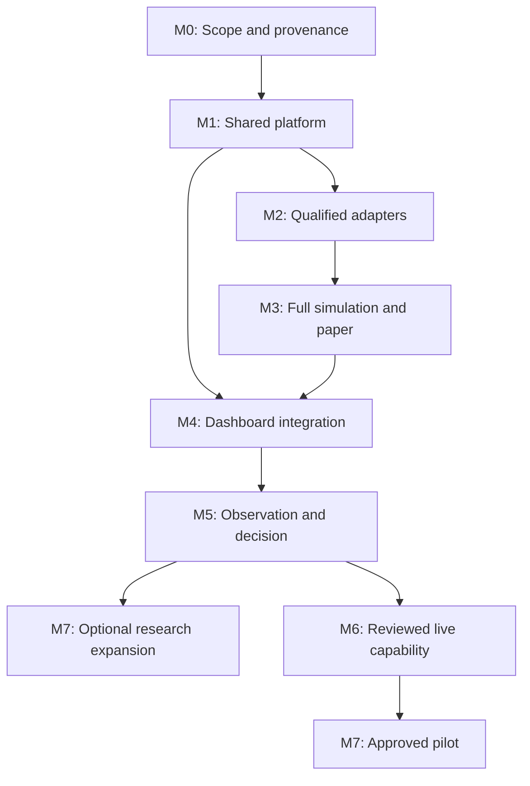

# End-to-end delivery backlog

Version 0.2.0 · 12 September 2026 · **8 epics and 68 work tickets (76 GitHub issues)**. Every item is planned. Existing scaffolding or a checked-in design is not proof that acceptance criteria have passed. The canonical machine-readable source is [backlog.json](backlog.json); [generate_backlog.py](generate_backlog.py) regenerates this package without network calls.

## Scope and operating rules

The initial product is a private Rust-first research platform for Solana and Base, using a React/TypeScript dashboard based on [the approved prototype](../design/dashboard-wireframe.html). Research includes OBSERVE, PAPER and REPLAY; it does not sign or broadcast. Initial routes are USDC-starting two-leg cycles through distinct qualified pools. Every added venue, token behavior, route shape or chain needs explicit qualification.

M0–M4 implement the research product. M5 gathers evidence and records a go/revise/stop decision. M6 is optional live implementation and review. M7 groups an optional pilot and individually gated expansions/maintenance. M7 research expansion is permitted after its own research decision and does not require a live pilot. Ticket creation is never permission to deploy execution artifacts, fund accounts, use signing keys or activate LIVE.

## Milestones and effort rollups

| Milestone / epic | Work tickets | Proposed person-days | Exit gate |
| --- | ---: | ---: | --- |
| M0 / EPIC-01 | 6 | 9-16 | Representative pool data is obtainable; registry/protocol scope and costs are understood; decisions have owners. |
| M1 / EPIC-02 | 9 | 23-35 | Clean research build, durable commands, restart-to-STOPPED and a versioned real observation decision trace are demonstrated. |
| M2 / EPIC-03 | 9 | 31-47 | Both initial pool families pass exact arithmetic and failure-state qualification; invalid state cannot pass eligibility. |
| M3 / EPIC-04 | 11 | 39-59 | One complete supported atomic route per chain fully simulates under declared virtual funding; evidence, cost and reservation gates pass. Otherwise only quote-research preview is releasable. |
| M4 / EPIC-05 | 9 | 25-35 | Controls, comparison, exports, accessibility and research deployment recovery pass; no signer or broadcast capability ships. |
| M5 / EPIC-06 | 6 | 14-24 | Adequate documented coverage, sampled replay/accounting review and a candid economics report support a recorded go/revise/stop decision. |
| M6 / EPIC-07 | 11 | 44-73 | Exact live configuration, independent review, signer/submission/reconciliation failure drills and operator decision are complete before activation. |
| M7 / EPIC-08 | 7 | 27-46 | Each pilot/expansion has its own qualifying evidence and required approval; actual outcomes reconcile and long-term maintenance or shutdown is documented. |

The detailed M0–M4 ticket estimates total **127–192 working person-days across engineering, product, design, QA and operations roles**. This is a refinement input, not a promised schedule. Earlier high-level guidance was 22–36 engineering person-weeks plus 3–5 support person-weeks; the detailed range should be reconciled after provider/adapter spikes and actual CI qualification. Do not add epic rollups on top of ticket effort. Do not equate summed person-days with elapsed days.

Assume two senior engineers with part-time product/UX/QA/operations support. Protocol arithmetic, state capture and complete transaction simulation dominate uncertainty. The observation campaign adds roughly 4–6 elapsed weeks and can extend for poor coverage. Live review availability, external review fees/remediation, infrastructure subscriptions, chain fees and trading capital are separate. Optional expansion estimates are scoped qualification slices and may expose further work; they are not commitments to support any arbitrary chain/token.

## Dependency and gate conventions

Dependencies in `backlog.json` are stable issue IDs. GitHub publishing should resolve them to actual links while retaining `<!-- arb-ticket:ARB-001 -->` markers for idempotency. Ticket prerequisites are authoritative. Epic order communicates stage-level release sequencing, not a rule that nobody may start dependent design work early.

The first integrated trace (ARB-015) deliberately consumes shared snapshot and route work listed under M2, which in this backlog requires both quote adapters. Base is the demonstration chain, not an earlier Base-only release. Those component tickets do not depend on ARB-015, so the graph remains acyclic. The paired-chain failure/qualification gate ARB-024 does depend on the integrated trace. UI work can start with the approved design and typed contracts while adapters are in progress.

## Acceptance policy

- Evidence labels remain CANDIDATE, SIMULATED, ESTIMATED_EXECUTABLE and REALIZED with their strict meanings. Local math/replay is CANDIDATE; full successful exact-plan simulation is required for SIMULATED. Paper never emits REALIZED.
- Executable-paper comparison requires at least one fully simulatable supported atomic route per chain under declared virtual funding plus complete costs, coherent/fresh state, principal/native-fee reservations, limits and atomic guards. Without the capability, release a clearly labeled quote-research preview only.
- Start/pause/stop distinguish command acceptance/PENDING from durable worker application/APPLIED. DRAINING retains unresolved previously emitted attempts. No control recalls a transaction already sent.
- Critical live journals record intent, signed payload and dispatch-start UNKNOWN before every network send. Signer DISARM needs durable epoch acknowledgement. Lease expiry does not revoke signed bytes and cannot alone authorize automatic takeover.
- Close an issue only after its acceptance evidence exists. An agent review is useful design input and does not count as independent execution security review.

## Ticket index

Each body is fully specified in [backlog.json](backlog.json) and also rendered in [TICKETS.md](TICKETS.md). Roles express responsibilities; no real person is assigned automatically.

| ID | Milestone | Priority | Responsible role | Estimate | Title / prerequisites |
| --- | --- | --- | --- | --- | --- |
| ARB-001 | M0 | P0 | Product Owner | 1-2 d | Ratify research scope, success measures and release gates Requires: none |
| ARB-002 | M0 | P0 | Operations engineer | 2-3 d | Qualify data providers and set a spending envelope Requires: ARB-001 |
| ARB-003 | M0 | P0 | Chain engineers | 2-4 d | Verify initial chain, token and venue identities Requires: ARB-001, ARB-002 |
| ARB-004 | M0 | P1 | Technical Lead / Operations | 1-2 d | Set deployment, retention and benchmark assumptions Requires: ARB-001, ARB-002 |
| ARB-005 | M0 | P0 | Security reviewer / Technical Lead | 2-3 d | Establish threat model, license provenance and paper boundaries Requires: ARB-001 |
| ARB-006 | M0 | P1 | Technical Lead / Product Owner | 1-2 d | Create delivery conventions, repository governance and acceptance workflow Requires: ARB-001, ARB-005 |
| ARB-007 | M1 | P0 | Technical Lead | 2-3 d | Build the Rust workspace and reproducible research CI Requires: ARB-004, ARB-005, ARB-006 |
| ARB-008 | M1 | P0 | Engine engineer | 3-5 d | Implement exact amounts, identities and evidence invariants Requires: ARB-007 |
| ARB-009 | M1 | P0 | Backend engineer | 2-3 d | Implement immutable validated experiment configuration Requires: ARB-003, ARB-008 |
| ARB-010 | M1 | P0 | Backend engineer | 3-5 d | Add PostgreSQL migrations, durable sessions and command journal Requires: ARB-008, ARB-009 |
| ARB-011 | M1 | P0 | Backend engineer / QA | 3-5 d | Implement worker lifecycle, cancellation fences and restart recovery Requires: ARB-010 |
| ARB-012 | M1 | P0 | Backend engineer | 3-4 d | Serve the authenticated control API and schema-consistent errors Requires: ARB-008, ARB-010, ARB-011 |
| ARB-013 | M1 | P1 | Systems engineer | 3-4 d | Add bounded scheduling, stage telemetry and chain isolation Requires: ARB-007, ARB-008, ARB-011 |
| ARB-014 | M1 | P1 | Data engineer | 2-3 d | Implement versioned capture manifests and fixture provenance Requires: ARB-008, ARB-009, ARB-010 |
| ARB-015 | M1 | P0 | Technical Lead / QA | 2-3 d | Deliver the first observation-to-control vertical slice Requires: ARB-012, ARB-013, ARB-014, ARB-016, ARB-018, ARB-022, ARB-023 |
| ARB-016 | M2 | P0 | EVM engineer | 4-6 d | Implement Base Uniswap V3 read-only ingestion Requires: ARB-002, ARB-003, ARB-008, ARB-009, ARB-014 |
| ARB-017 | M2 | P0 | Solana engineer | 4-6 d | Implement Solana Orca Whirlpool read-only ingestion Requires: ARB-002, ARB-003, ARB-008, ARB-009, ARB-014 |
| ARB-018 | M2 | P0 | Chain engineers | 4-6 d | Build coherent snapshots, freshness gates and rollback handling Requires: ARB-016, ARB-017 |
| ARB-019 | M2 | P0 | EVM engineer | 4-6 d | Qualify exact Uniswap V3 quote arithmetic Requires: ARB-008, ARB-016, ARB-018 |
| ARB-020 | M2 | P0 | Solana engineer | 4-6 d | Qualify exact Orca Whirlpool quote arithmetic Requires: ARB-008, ARB-017, ARB-018 |
| ARB-021 | M2 | P0 | Technical Lead / Chain engineers | 2-3 d | Enforce adapter capability readiness and registry activation Requires: ARB-003, ARB-009, ARB-019, ARB-020 |
| ARB-022 | M2 | P0 | Engine engineer | 3-5 d | Implement bounded distinct-pool cyclic route discovery Requires: ARB-008, ARB-009, ARB-019, ARB-020, ARB-021 |
| ARB-023 | M2 | P1 | Engine engineer / Data engineer | 3-4 d | Persist decision traces, rejections and opportunity deduplication Requires: ARB-010, ARB-014, ARB-018, ARB-022 |
| ARB-024 | M2 | P0 | QA / Chain engineers | 3-5 d | Run dual-chain adapter qualification and chaos gate Requires: ARB-013, ARB-015, ARB-019, ARB-020, ARB-021, ARB-023 |
| ARB-025 | M3 | P0 | Engine engineer | 4-6 d | Implement complete cost ledger and reproducible valuation Requires: ARB-008, ARB-023 |
| ARB-026 | M3 | P0 | Engine engineer | 4-6 d | Build virtual portfolios, principal and fee reservations Requires: ARB-010, ARB-025 |
| ARB-027 | M3 | P0 | Engine engineer | 4-6 d | Implement deterministic offline replay and compatibility checks Requires: ARB-014, ARB-019, ARB-020, ARB-023 |
| ARB-028 | M3 | P0 | EVM engineer | 5-7 d | Build research-only Base transaction plans and atomic guard artifact Requires: ARB-019, ARB-021, ARB-025 |
| ARB-029 | M3 | P0 | Solana engineer | 5-7 d | Build research-only Solana transaction plans and final balance guard Requires: ARB-020, ARB-021, ARB-025 |
| ARB-030 | M3 | P0 | EVM engineer | 3-5 d | Implement complete Base simulation and exact-plan evidence Requires: ARB-018, ARB-027, ARB-028 |
| ARB-031 | M3 | P0 | Solana engineer | 3-5 d | Implement complete Solana simulation and exact-plan evidence Requires: ARB-018, ARB-027, ARB-029 |
| ARB-032 | M3 | P0 | Research engineer | 3-5 d | Model delay, inclusion and failure scenarios without false certainty Requires: ARB-025, ARB-026, ARB-027, ARB-030, ARB-031 |
| ARB-033 | M3 | P0 | Engine engineer / QA | 2-3 d | Enforce estimated-executable evidence eligibility Requires: ARB-024, ARB-025, ARB-026, ARB-030, ARB-031, ARB-032 |
| ARB-034 | M3 | P1 | Research engineer / Product Owner | 3-4 d | Implement fair comparison cohorts and holdout analysis Requires: ARB-023, ARB-025, ARB-026, ARB-032, ARB-033 |
| ARB-035 | M3 | P0 | QA / Technical Lead | 3-5 d | Pass executable-paper release gate and financial correctness review Requires: ARB-024, ARB-026, ARB-027, ARB-030, ARB-031, ARB-033, ARB-034 |
| ARB-036 | M4 | P1 | Frontend engineer / UI Designer | 3-4 d | Implement the approved dashboard shell and design tokens Requires: ARB-006, ARB-008 |
| ARB-037 | M4 | P1 | Frontend engineer / Backend engineer | 3-4 d | Connect dashboard queries, provenance and data-quality states Requires: ARB-012, ARB-023, ARB-036 |
| ARB-038 | M4 | P1 | Frontend engineer / Product Owner | 3-4 d | Implement experiment creation, immutable settings and capability feedback Requires: ARB-009, ARB-012, ARB-021, ARB-036 |
| ARB-039 | M4 | P0 | Frontend engineer / QA | 3-4 d | Implement start, pause, resume and stop acknowledgement UX Requires: ARB-011, ARB-012, ARB-036, ARB-037 |
| ARB-040 | M4 | P1 | Frontend engineer / Research engineer | 3-4 d | Build run history, portfolio ledger and comparison views Requires: ARB-026, ARB-034, ARB-037, ARB-038 |
| ARB-041 | M4 | P1 | Data engineer / Frontend engineer | 2-3 d | Implement reproducible JSON/CSV exports and redaction Requires: ARB-023, ARB-027, ARB-034, ARB-040 |
| ARB-042 | M4 | P1 | Operations engineer / Frontend engineer | 3-4 d | Instrument system health, alerts and actionable diagnostics Requires: ARB-013, ARB-024, ARB-037 |
| ARB-043 | M4 | P1 | UI/UX Designer / QA | 2-3 d | Pass dashboard accessibility, responsiveness and failure-state review Requires: ARB-037, ARB-038, ARB-039, ARB-040, ARB-041, ARB-042 |
| ARB-044 | M4 | P0 | Operations engineer / QA | 3-5 d | Ship the research deployment with backups and recovery proof Requires: ARB-035, ARB-039, ARB-041, ARB-042, ARB-043 |
| ARB-045 | M5 | P0 | Product Owner / Research engineer | 2-3 d | Register the observation campaign and analysis protocol Requires: ARB-034, ARB-044 |
| ARB-046 | M5 | P0 | Operations engineer | 3-5 d | Operate the campaign and keep a data-quality incident log Requires: ARB-045 |
| ARB-047 | M5 | P0 | QA / Research engineer | 3-5 d | Audit replay samples and investigate accounting or model discrepancies Requires: ARB-046 |
| ARB-048 | M5 | P0 | Research engineer / Product Owner | 3-5 d | Produce the comparative economics and feasibility report Requires: ARB-046, ARB-047 |
| ARB-049 | M5 | P0 | Technical Lead / Security reviewer | 2-4 d | Run operational and research-security readiness review Requires: ARB-044, ARB-047 |
| ARB-050 | M5 | P0 | Operator / Product Owner | 1-2 d | Record the go, revise or stop decision and optional live prerequisites Requires: ARB-048, ARB-049 |
| ARB-051 | M6 | P0 | Architect / Operator | 2-4 d | Approve a concrete live execution design and limit specification Requires: ARB-050 |
| ARB-052 | M6 | P0 | Security engineer | 5-8 d | Implement isolated signer policies, epochs and durable disarm Requires: ARB-051 |
| ARB-053 | M6 | P0 | Chain engineer / Security reviewer | 6-10 d | Harden execution artifacts and enforce live atomic constraints Requires: ARB-028, ARB-029, ARB-051 |
| ARB-054 | M6 | P0 | Engine engineer | 4-6 d | Implement live inventory, fee reservations and submission-time risk checks Requires: ARB-026, ARB-051 |
| ARB-055 | M6 | P0 | Backend engineer | 4-6 d | Implement durable intent, signed-payload and dispatch-start journals Requires: ARB-010, ARB-052, ARB-054 |
| ARB-056 | M6 | P0 | Chain engineer | 4-6 d | Integrate the approved chain-specific submission transport Requires: ARB-053, ARB-055 |
| ARB-057 | M6 | P0 | Chain engineer / Backend engineer | 5-8 d | Reconcile pending, unknown, failed and finalized live outcomes Requires: ARB-055, ARB-056 |
| ARB-058 | M6 | P0 | Systems engineer / QA | 4-6 d | Implement fencing, crash recovery and controlled takeover Requires: ARB-011, ARB-052, ARB-055, ARB-057 |
| ARB-059 | M6 | P0 | Frontend engineer / Security engineer | 3-5 d | Add explicit live readiness, arming and incident-control UX Requires: ARB-039, ARB-051, ARB-052, ARB-054, ARB-057, ARB-058 |
| ARB-060 | M6 | P0 | Independent reviewer / Implementers | 5-10 d | Complete independent execution review and adversarial remediation Requires: ARB-052, ARB-053, ARB-054, ARB-055, ARB-056, ARB-057, ARB-058, ARB-059 |
| ARB-061 | M6 | P0 | Technical Lead / Operator | 2-4 d | Prepare the bounded live pilot release and final approval packet Requires: ARB-050, ARB-060 |
| ARB-062 | M7 | P0 | Operator / Operations engineer | 3-5 d | Deploy and run one explicitly approved bounded live pilot Requires: ARB-061 |
| ARB-063 | M7 | P0 | Product Owner / Operator | 2-3 d | Evaluate the pilot and approve continuation, reduction or shutdown Requires: ARB-062 |
| ARB-064 | M7 | P1 | Chain engineers | 5-8 d | Qualify a second venue per chain for research coverage Requires: ARB-035, ARB-048, ARB-050 |
| ARB-065 | M7 | P2 | Engine engineer / Chain engineers | 4-7 d | Add reviewed token universes and optional three-leg research routes Requires: ARB-064 |
| ARB-066 | M7 | P2 | Architect / Chain engineer | 6-10 d | Qualify an additional chain through the adapter and operations contract Requires: ARB-048, ARB-050, ARB-064 |
| ARB-067 | M7 | P2 | EVM or Solana engineer / Security reviewer | 5-9 d | Assess and implement an optional atomic funding adapter Requires: ARB-051, ARB-053, ARB-060, ARB-063 |
| ARB-068 | M7 | P1 | Technical Lead / Operations / Operator | 2-4 d | Establish maintenance, change control and safe project closeout Requires: ARB-044, ARB-050 |

## Requirement coverage

| Requirement | Ticket evidence |
| --- | --- |
| NFR-01 | ARB-003, ARB-007, ARB-008, ARB-019, ARB-020, ARB-024, ARB-025, ARB-028, ARB-029, ARB-035, ARB-047, ARB-053 |
| NFR-02 | ARB-002, ARB-004, ARB-013, ARB-022, ARB-024, ARB-056 |
| NFR-03 | ARB-004, ARB-011, ARB-013, ARB-022, ARB-065 |
| NFR-04 | ARB-010, ARB-011, ARB-018, ARB-024, ARB-044, ARB-049, ARB-055, ARB-057, ARB-058, ARB-066, ARB-068 |
| NFR-05 | ARB-002, ARB-013, ARB-042, ARB-046 |
| NFR-06 | ARB-005, ARB-006, ARB-007, ARB-044, ARB-049, ARB-051, ARB-053, ARB-060, ARB-068 |
| NFR-07 | ARB-036, ARB-039, ARB-043, ARB-059 |
| NFR-08 | ARB-004, ARB-006, ARB-007, ARB-009, ARB-014, ARB-016, ARB-017, ARB-027, ARB-068 |
| PRD-F01 | ARB-001, ARB-008, ARB-009, ARB-038, ARB-065 |
| PRD-F02 | ARB-003, ARB-008, ARB-009, ARB-016, ARB-017, ARB-021, ARB-038, ARB-064, ARB-065, ARB-066 |
| PRD-F03 | ARB-002, ARB-015, ARB-016, ARB-017, ARB-018, ARB-024, ARB-037, ARB-042, ARB-046, ARB-066 |
| PRD-F04 | ARB-003, ARB-019, ARB-020, ARB-021, ARB-022, ARB-023, ARB-064, ARB-065 |
| PRD-F05 | ARB-025, ARB-032, ARB-035, ARB-047, ARB-048 |
| PRD-F06 | ARB-008, ARB-015, ARB-018, ARB-021, ARB-023, ARB-028, ARB-029, ARB-030, ARB-031, ARB-033, ARB-035, ARB-037, ARB-064, ARB-066 |
| PRD-F07 | ARB-026, ARB-028, ARB-029, ARB-030, ARB-031, ARB-032, ARB-033, ARB-035, ARB-038 |
| PRD-F08 | ARB-014, ARB-027, ARB-035, ARB-047 |
| PRD-F09 | ARB-001, ARB-032, ARB-034, ARB-040, ARB-045, ARB-048, ARB-063 |
| PRD-F10 | ARB-025, ARB-026, ARB-034, ARB-040, ARB-047, ARB-057, ARB-063 |
| PRD-F11 | ARB-010, ARB-011, ARB-012, ARB-015, ARB-039, ARB-043, ARB-058 |
| PRD-F12 | ARB-012, ARB-015, ARB-023, ARB-036, ARB-037, ARB-039, ARB-042, ARB-043 |
| PRD-F13 | ARB-004, ARB-010, ARB-014, ARB-023, ARB-040, ARB-041, ARB-044, ARB-046, ARB-068 |
| PRD-F14 | ARB-001, ARB-050, ARB-051, ARB-052, ARB-053, ARB-059, ARB-061, ARB-062, ARB-067 |
| PRD-F15 | ARB-054, ARB-055, ARB-056, ARB-057, ARB-058, ARB-059, ARB-061, ARB-062 |
| PRD-F16 | ARB-005, ARB-012, ARB-041, ARB-044, ARB-049, ARB-052, ARB-060, ARB-068 |
| PRD-F17 | ARB-026, ARB-033, ARB-050, ARB-051, ARB-052, ARB-053, ARB-054, ARB-056, ARB-059, ARB-060, ARB-061, ARB-062, ARB-063, ARB-067 |
| PRD-F18 | ARB-034, ARB-041, ARB-045, ARB-048 |

## Completion and verification record

The generator checks unique IDs, required metadata, stable issue markers, valid prerequisites, absence of dependency cycles, 18 functional requirements and eight nonfunctional requirements. [validation.json](validation.json) records package integrity only; it does not claim software tests, GitHub publication, browser review, protocol correctness or trading safety have passed.

Open decision roles, acceptance gates and assumptions are in [the PRD](../docs/01-PRD.md), [delivery plan](../docs/07-DELIVERY-PLAN.md) and [decision register](../docs/09-DECISIONS-AND-OPEN-QUESTIONS.md). Keep these documents and ticket scope synchronized when decisions change.
