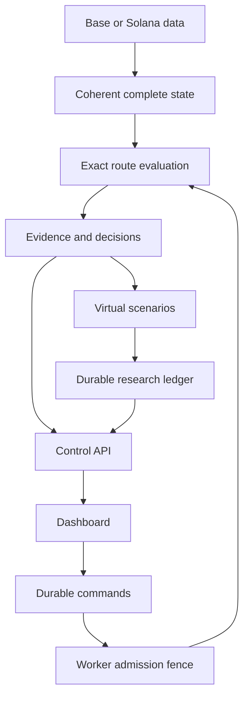

# Architecture

Current source is a modular Rust workspace with bounded Base/Solana capture, exact pool math, a two-pool research engine, PostgreSQL control/history/virtual accounting, an Axum API and a connected React/TypeScript dashboard. A restricted signer and live execution remain future components. See [implementation status](https://github.com/makafeli/arbitrage-research/blob/main/docs/12-IMPLEMENTATION-STATUS.md) and [integration verification](https://github.com/makafeli/arbitrage-research/blob/main/docs/17-RESEARCH-INTEGRATION-VERIFICATION.md) for source and acceptance boundaries.

## Boundaries

| Boundary | Responsibility |
|---|---|
| Domain | Chain/asset identity, checked integer amounts, route/evidence invariants; no I/O |
| Capture and adapters | Allowlisted read-only RPC, retained state/provenance and bounded exact pool math; transaction building is future scope |
| Scheduler and engine | Generation/age bounds and same-context two-pool CANDIDATE decisions; no RPC or database calls inside math |
| Paper and replay | Checked virtual accounts/journal and retained-input verification/evaluation; automatic fills and complete transaction simulation remain future scope |
| Control and storage | Durable commands, worker epochs/revisions, capture admission and immutable research/account history |
| Dashboard | Present typed facts and command status; no independent trade authorization |
| Signer, later | Decode and enforce exact allowed transactions; never broadcast |

Tokio handles asynchronous service/control I/O. The current worker performs one bounded blocking capture batch at a time, with per-request and cumulative transport budgets, then bounded deterministic evaluation. Deterministic calculations do not fetch current network data. More parallel CPU scheduling is a target, not a measured performance claim. The UI stays outside worker admission and accounting transactions.

Railway is the selected host: the prepared graph has one public web origin and private API/PostgreSQL. Use one API replica while browser authentication is process-local, one owner per session and separate persistent worker capture volumes. No worker needs a public port. See the [runbook](https://github.com/makafeli/arbitrage-research/blob/main/deploy/RAILWAY.md); these definitions do not establish an actual deployment.

## Target data flow

Capture, exact candidate evaluation, durable decision storage, controls and API/dashboard inspection are integrated in source. The diagram's automatic virtual-scenario path is still a target: the current PAPER worker stores CANDIDATE decisions and does not settle them into account balances. Complete transaction simulation remains required before executable-paper comparisons.

## State and identity

A token identity is network plus address/mint, not ticker. Base state names a block and hash; Solana state includes slot/context, account completeness and commitment. Independently fetched account values are not assumed coherent. Current per-pool acquisition does not guarantee one shared state anchor for a whole batch; the engine rejects pairs with unequal full contexts. Local capture receipt age does not establish block/slot lag. Provider qualification and an explicit state-lag policy remain necessary. Gaps, incompatible program/token behavior and rollbacks invalidate dependent work.

Amounts use checked integers in base units. Browser JSON serializes them as decimal strings. Pool math follows each protocol's rounding and fee treatment. The current candidate result includes protocol pool fees and impact, but external execution costs and net profit remain unavailable (`null`). Future reporting conversion must record source, timestamp and policy; a stablecoin symbol does not authorize a one-dollar assumption. Replay requires an explicit modeled historical age and preserves the captured origin; it does not reconstruct an unrecorded arrival timeline.

Each session has one immutable OBSERVE, PAPER, REPLAY or LIVE mode. Changing mode requires a new session after the preceding session is stopped. Restart begins in RECOVERING and reaches STOPPED before explicit start. There is no automatic live arming.

## Durable control and future live execution

An API command starts PENDING. APPLIED means the worker installed its effective local admission/submission fence at the acknowledged revision. Stop can remain DRAINING until already dispatched attempts resolve. A timeout or disconnected browser does not prove the worker stopped.

Later live submission must commit intent/reservations, then signed identity, then an UNKNOWN dispatch-start record before every network send. Recovery reconciles that identity rather than inventing a new trade. Signer revocation cannot recall previously signed or emitted bytes. Initial live scope has no automatic failover before the previous worker is fenced and its unresolved attempts reconciled.

Read the [full architecture](https://github.com/makafeli/arbitrage-research/blob/main/docs/02-ARCHITECTURE.md), [repository structure](https://github.com/makafeli/arbitrage-research/blob/main/docs/03-REPOSITORY-STRUCTURE.md) and [data/API contracts](https://github.com/makafeli/arbitrage-research/blob/main/docs/08-DATA-AND-API-CONTRACTS.md) before changing these boundaries.
