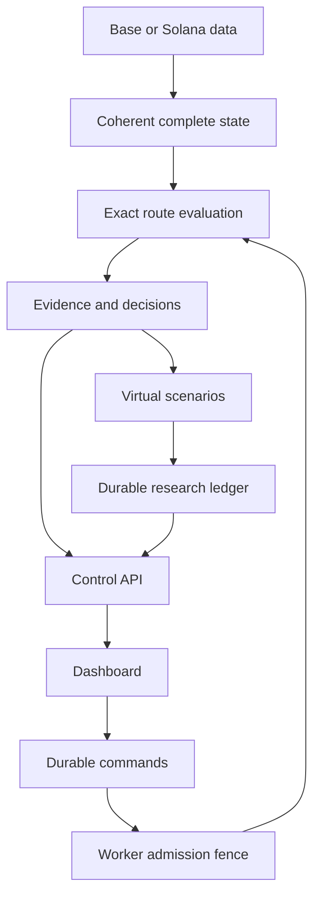

# Architecture

The target is one modular Rust workspace with separate Base and Solana worker processes, an Axum control API, PostgreSQL durable storage and a React/TypeScript dashboard. A restricted signer is a later live-only component. The current foundation implements a subset; see [implementation status](https://github.com/makafeli/arbitrage-research/blob/main/docs/12-IMPLEMENTATION-STATUS.md).

## Boundaries

| Boundary | Responsibility |
|---|---|
| Domain | Chain/asset identity, checked integer amounts, route/evidence invariants; no I/O |
| Adapters | Chain-specific coherent state, exact pool math, transaction capabilities and provenance |
| Engine and risk | Bounded route evaluation, freshness, inventory/fee reservations and eligibility |
| Paper and replay | Virtual inventory, declared delay scenarios and deterministic captured-state processing |
| Control and storage | Durable commands, revisions, intent records, journal and reconciliation |
| Dashboard | Present typed facts and command status; no independent trade authorization |
| Signer, later | Decode and enforce exact allowed transactions; never broadcast |

Tokio handles asynchronous I/O. CPU route work has bounded concurrency and queue capacity. Deterministic calculations do not fetch current network data. The UI and analytics stay outside the decision/submission path; critical journal durability stays inside that path.

## Target data flow

This diagram describes the research target, not current working integrations. Complete transaction simulation is a separate capability required before executable-paper comparisons.

## State and identity

A token identity is network plus address/mint, not ticker. Base state names a block and hash; Solana state includes slot/context, account completeness and commitment. Independently fetched account values are not assumed coherent. Gaps, incompatible program/token behavior and rollbacks invalidate dependent work.

Amounts use checked integers in base units. Browser JSON serializes them as decimal strings. Pool math follows each protocol's rounding and fee treatment. Reporting conversion records source, timestamp and policy; a stablecoin symbol does not authorize a one-dollar assumption.

Each session has one immutable OBSERVE, PAPER, REPLAY or LIVE mode. Changing mode requires a new session after the preceding session is stopped. Restart begins in RECOVERING and reaches STOPPED before explicit start. There is no automatic live arming.

## Durable control and future live execution

An API command starts PENDING. APPLIED means the worker installed its effective local admission/submission fence at the acknowledged revision. Stop can remain DRAINING until already dispatched attempts resolve. A timeout or disconnected browser does not prove the worker stopped.

Later live submission must commit intent/reservations, then signed identity, then an UNKNOWN dispatch-start record before every network send. Recovery reconciles that identity rather than inventing a new trade. Signer revocation cannot recall previously signed or emitted bytes. Initial live scope has no automatic failover before the previous worker is fenced and its unresolved attempts reconciled.

Read the [full architecture](https://github.com/makafeli/arbitrage-research/blob/main/docs/02-ARCHITECTURE.md), [repository structure](https://github.com/makafeli/arbitrage-research/blob/main/docs/03-REPOSITORY-STRUCTURE.md) and [data/API contracts](https://github.com/makafeli/arbitrage-research/blob/main/docs/08-DATA-AND-API-CONTRACTS.md) before changing these boundaries.
